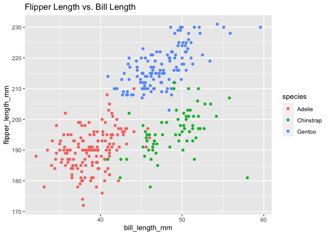

p8105\_hw1\_rr3423
================
Ragyie Rawal
2021-09-26

## PROBLEM 1

``` r
# Setting seed  
set.seed(1)

# Creating a dataframe
prob_one_df = tibble(
  random_sample = rnorm(10),
  vec_logical = random_sample > 0, 
  vec_character = c("a", "b", "c", "d", "e", "f", "g", "h", "i", "j"),
  vec_factor = factor(c("low", "medium", "high", "low", "medium", "high", "low", "medium", "high", "low" ))
)

knitr::kable(prob_one_df)
```

| random\_sample | vec\_logical | vec\_character | vec\_factor |
|---------------:|:-------------|:---------------|:------------|
|     -0.6264538 | FALSE        | a              | low         |
|      0.1836433 | TRUE         | b              | medium      |
|     -0.8356286 | FALSE        | c              | high        |
|      1.5952808 | TRUE         | d              | low         |
|      0.3295078 | TRUE         | e              | medium      |
|     -0.8204684 | FALSE        | f              | high        |
|      0.4874291 | TRUE         | g              | low         |
|      0.7383247 | TRUE         | h              | medium      |
|      0.5757814 | TRUE         | i              | high        |
|     -0.3053884 | FALSE        | j              | low         |

``` r
# taking the mean of each variable in the dataframe
mean_random_sample = mean(pull(prob_one_df, random_sample))

mean_vec_logical = mean(pull(prob_one_df, vec_logical))

mean_vec_character = mean(pull(prob_one_df, vec_character))
```

    ## Warning in mean.default(pull(prob_one_df, vec_character)): argument is not
    ## numeric or logical: returning NA

``` r
mean_vec_factor = mean(pull(prob_one_df, vec_factor))
```

    ## Warning in mean.default(pull(prob_one_df, vec_factor)): argument is not numeric
    ## or logical: returning NA

When attempting to take the mean of each variable in the dataframe, it
was possible to successfully take the mean of the random sample variable
and the mean of the logical variable. It was not possible to take the
mean of the character variable or the mean of the factor variable.

``` r
# Applying the as.numeric function to the logical, character, and factor variables 
convert_logical = as.numeric(pull(prob_one_df, vec_logical))

convert_character = as.numeric(pull(prob_one_df, vec_character))

convert_factor = as.numeric(pull(prob_one_df, vec_factor))
```

Converting the logical variable using the as.numeric function converts
the “TRUE” and “FALSE” values to “1” and “0” numeric values. This
conversion works because the TRUE and FALSE values can be converted to
corresponding numeric values. This helps explain why it is possible to
take the mean of the logical variable because the logical values can be
converted to numeric values, and then the mean of the numeric values can
be calculated.

Converting the character variable using the as.numeric function does not
work because there are only character strings in the character variable,
and character strings cannot directly be converted to numeric values.
This is why there is a warning message that “NAs introduced by coercion”
because R failed to convert the character strings to numeric values.
This helps explain why it is not possible to take the mean of the
character variable. It is not possible to take the mean of character
strings because they are not numeric values.

Converting the factor variable using the as.numeric function does not
give the expected output. This conversion only provides the factor
levels, but not the numeric values contained in the factor vector. This
is because the factor vector is in character format, so it only gives
the factor levels. This explains why it is not possible to get the mean
of the factor variable because it is not possible to get the mean of
character strings.

## PROBLEM 2

``` r
# loading dataset 
data("penguins", package = "palmerpenguins")

# looking at the names and values of important variables 
names_species = pull(penguins, species)

names_island = pull(penguins, island)

names_sex = pull(penguins, sex)

names_year = pull(penguins, year)

# calculating means and standard deviations for important numeric variables

mean_bill_length = mean(pull(penguins, bill_length_mm), na.rm = TRUE)
sd_bill_length = sd(pull(penguins, bill_length_mm), na.rm = TRUE)

mean_bill_depth = mean(pull(penguins, bill_depth_mm), na.rm = TRUE)
sd_bill_depth = sd(pull(penguins, bill_depth_mm), na.rm = TRUE)

mean_flipper_length = mean(pull(penguins, flipper_length_mm), na.rm = TRUE)
sd_flipper_length = sd(pull(penguins, flipper_length_mm), na.rm = TRUE)

mean_body_mass = mean(pull(penguins, body_mass_g), na.rm = TRUE)
sd_body_mass = sd(pull(penguins, body_mass_g), na.rm = TRUE)

# determining mean flipper length 
mean_flipper_length = mean(pull(penguins, flipper_length_mm), na.rm = TRUE)
```

The important variables in the penguins dataset are species, island,
bill\_length\_mm, bill\_depth\_mm, flipper\_length\_mm, body\_mass\_g,
sex, year.

The species in this dataset are Adelie, Gentoo, Chinstrap.

The islands in this dataset are Torgersen, Biscoe, Dream.

The sex in this dataset are male, female.

The years in this dataset are 2007, 2008, 2009.

The mean of the bill lengths is 43.92 mm. The standard deviation of bill
lengths is 5.46 mm.

The mean of the bill depths is 17.15 mm. The standard deviation of bill
depths is 1.97 mm.

The mean of the flipper lengths is 200.92 mm. The standard deviation of
flipper lengths is 14.06 mm.

The mean of the body weights is 4201.75 mm. The standard deviation of
body weights is 801.95 mm.

The number of rows in the penguins dataset is 344. The number of columns
in the penguins dataset is 8.

The mean flipper length is 200.92 mm.

``` r
# creating dataframe for flipper length, bill length, and species 
plot_df = tibble(
  bill_length_mm = penguins$bill_length_mm,
  flipper_length_mm = penguins$flipper_length_mm,
  species = penguins$species
)

# making scatterplot for flipper length and bill length
ggplot(plot_df, aes(x = bill_length_mm, y = flipper_length_mm, color = species)) + geom_point() + ggtitle("Flipper Length vs. Bill Length")
```

<!-- -->

``` r
# exporting scatterplot to project directory 
ggsave("p2_scatter_plot.pdf", height = 4, width = 6)
```
